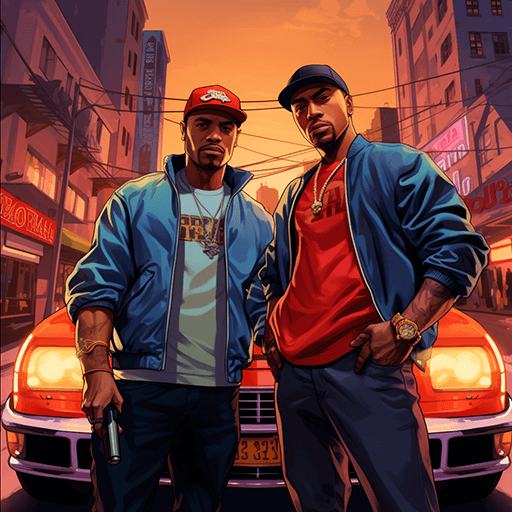
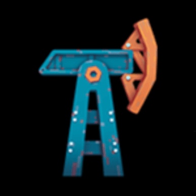
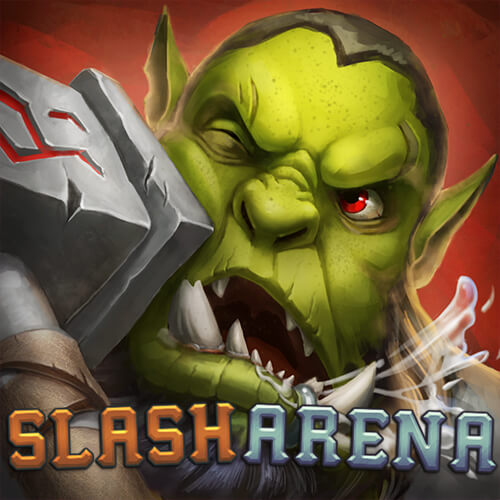
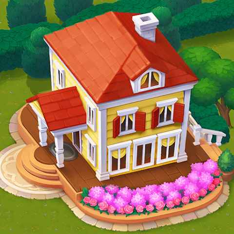
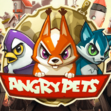
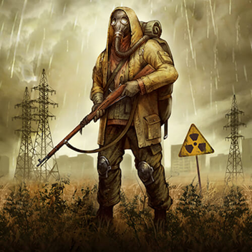

# XXX TTT

<table>
    <tbody>
    <tr>
      <th align="center" colspan="4">
          <b>1</b>
      </th>
   </tr>
   <tr>
        <td class="table-image">
            
        </td>
        <td class="table-td">
            <b class="table-title">TODO</b>
            

                
                
                
            

            

                TODO
            

            <a href="https://rparamonov.github.io/test/">[youtube]</a>
            <a href="https://rparamonov.github.io/test/">[screenshoots]</a>
        </td>
        <td class="table-image">
            
        </td>
        <td class="table-td">
            <b class="table-title">TODO</b>
            

                
                
                
            

            

                TODO
            

            <a href="https://rparamonov.github.io/test/">[youtube]</a>
            <a href="https://rparamonov.github.io/test/">[screenshoots]</a>
        </td>
    </tr>
    <tr>
        <td class="table-image">
            
        </td>
        <td class="table-td">
            <b class="table-title">TODO</b>
            

                
                
                
            

            

                TODO
            

            <a href="https://rparamonov.github.io/test/">[youtube]</a>
            <a href="https://rparamonov.github.io/test/">[screenshoots]</a>
        </td>
        <td class="table-image">
            
        </td>
        <td class="table-td">
            <b class="table-title">TODO</b>
            

                
                
                
            

            

                TODO
            

            <a href="https://rparamonov.github.io/test/">[youtube]</a>
            <a href="https://rparamonov.github.io/test/">[screenshoots]</a>
        </td>
    </tr>
    <tr>
        <td class="table-image">
            
        </td>
        <td class="table-td">
            <b class="table-title">TODO</b>
            

                
                
                
            

            

                TODO
            

            <a href="https://rparamonov.github.io/test/">[youtube]</a>
            <a href="https://rparamonov.github.io/test/">[screenshoots]</a>
        </td>
        <td class="table-image">
            
        </td>
        <td class="table-td">
            <b class="table-title">TODO</b>
            

                
                
                
            

            

                TODO
            

            <a href="https://rparamonov.github.io/test/">[youtube]</a>
            <a href="https://rparamonov.github.io/test/">[screenshoots]</a>
        </td>
    </tr>
    <tr>
        <td class="table-image">
            
        </td>
        <td class="table-td">
            <b class="table-title">TODO</b>
            

                
                
                
            

            

                TODO
            

            <a href="https://rparamonov.github.io/test/">[youtube]</a>
            <a href="https://rparamonov.github.io/test/">[screenshoots]</a>
        </td>
        <td class="table-image">
            
        </td>
        <td class="table-td">
            <b class="table-title">TODO</b>
            

                
                
                
            

            

                TODO
            

            <a href="https://rparamonov.github.io/test/">[youtube]</a>
            <a href="https://rparamonov.github.io/test/">[screenshoots]</a>
        </td>
    </tr>
     <tr>
        <td class="table-image">
            
        </td>
        <td class="table-td">
            <b class="table-title">TODO</b>
            

                
                
                
            

            

                TODO
            

            <a href="https://rparamonov.github.io/test/">[youtube]</a>
            <a href="https://rparamonov.github.io/test/">[screenshoots]</a>
        </td>
        <td class="table-image">
            
        </td>
        <td class="table-td">
            <b class="table-title">TODO</b>
            

                
                
                
            

            

                TODO
            

            <a href="https://rparamonov.github.io/test/">[youtube]</a>
            <a href="https://rparamonov.github.io/test/">[screenshoots]</a>
        </td>
    </tr>
    <tr>
        <td class="table-image">
            
        </td>
        <td class="table-td">
            <b class="table-title">TODO</b>
            

                
                
                
            

            

                TODO
            

            <a href="https://rparamonov.github.io/test/">[youtube]</a>
            <a href="https://rparamonov.github.io/test/">[screenshoots]</a>
        </td>
        <td class="table-image">
            
        </td>
        <td class="table-td">
            <b class="table-title">TODO</b>
            

                
                
                
            

            

                TODO
            

            <a href="https://rparamonov.github.io/test/">[youtube]</a>
            <a href="https://rparamonov.github.io/test/">[screenshoots]</a>
        </td>
    </tr>
    <tr>
        <td class="table-image">
            
        </td>
        <td class="table-td">
            <b class="table-title">TODO</b>
            

                
                
                
            

            

                TODO
            

            <a href="https://rparamonov.github.io/test/">[youtube]</a>
            <a href="https://rparamonov.github.io/test/">[screenshoots]</a>
        </td>
        <td class="table-image">
            
        </td>
        <td class="table-td">
            <b class="table-title">TODO</b>
            

                
                
                
            

            

                TODO
            

            <a href="https://rparamonov.github.io/test/">[youtube]</a>
            <a href="https://rparamonov.github.io/test/">[screenshoots]</a>
        </td>
    </tr>
    <tr>
        <td class="table-image">
            
        </td>
        <td class="table-td">
            <b class="table-title">TODO</b>
            

                
                
                
            

            

                TODO
            

            <a href="https://rparamonov.github.io/test/">[youtube]</a>
            <a href="https://rparamonov.github.io/test/">[screenshoots]</a>
        </td>
        <td class="table-image">
            
        </td>
        <td class="table-td">
            <b class="table-title">TODO</b>
            

                
                
                
            

            

                TODO
            

            <a href="https://rparamonov.github.io/test/">[youtube]</a>
            <a href="https://rparamonov.github.io/test/">[screenshoots]</a>
        </td>
    </tr>
    <tr>
        <td class="table-image">
            
        </td>
        <td class="table-td">
            <b class="table-title">TODO</b>
            

                
                
                
            

            

                TODO
            

            <a href="https://rparamonov.github.io/test/">[youtube]</a>
            <a href="https://rparamonov.github.io/test/">[screenshoots]</a>
        </td>
        <td class="table-image">
            
        </td>
        <td class="table-td">
            <b class="table-title">TODO</b>
            

                
                
                
            

            

                TODO
            

            <a href="https://rparamonov.github.io/test/">[youtube]</a>
            <a href="https://rparamonov.github.io/test/">[screenshoots]</a>
        </td>
    </tr>
    <tr>
        <td class="table-image">
            
        </td>
        <td class="table-td">
            <b class="table-title">TODO</b>
            

                
                
                
            

            

                TODO
            

            <a href="https://rparamonov.github.io/test/">[youtube]</a>
            <a href="https://rparamonov.github.io/test/">[screenshoots]</a>
        </td>
        <td class="table-image">
            
        </td>
        <td class="table-td">
            <b class="table-title">TODO</b>
            

                
                
                
            

            

                TODO
            

            <a href="https://rparamonov.github.io/test/">[youtube]</a>
            <a href="https://rparamonov.github.io/test/">[screenshoots]</a>
        </td>
    </tr>
   <tr>
        <td class="table-image">
            
        </td>
        <td class="table-td">
            <b class="table-title">TODO</b>
            

                
                
                
            

            

                TODO
            

            <a href="https://rparamonov.github.io/test/">[youtube]</a>
            <a href="https://rparamonov.github.io/test/">[screenshoots]</a>
        </td>
        <td class="table-image">
            
        </td>
        <td class="table-td">
            <b class="table-title">TODO</b>
            

                
                
                
            

            

                TODO
            

            <a href="https://rparamonov.github.io/test/">[youtube]</a>
            <a href="https://rparamonov.github.io/test/">[screenshoots]</a>
        </td>
    </tr>
    <tr>
        <td class="table-soft" colspan="3">
            
            
            
            
            
        </td>
        <td class="table-td">
            <b class="table-title">TODO</b>
            

                
                
                
            

            

                TODO
            

            <a href="https://rparamonov.github.io/test/">[youtube]</a>
            <a href="https://rparamonov.github.io/test/">[screenshoots]</a>
        </td>
    </tr>
    </tbody>
</table>    

<h4 id="3123">3123</h4>

